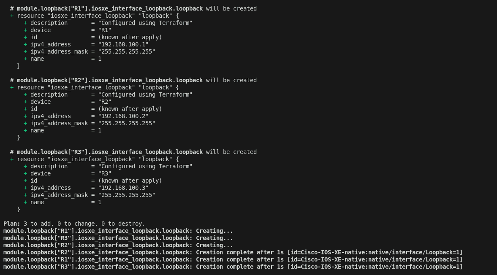
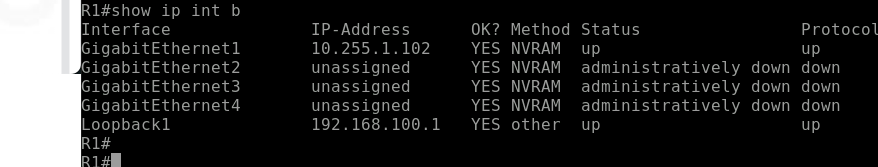
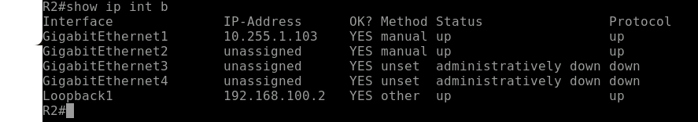
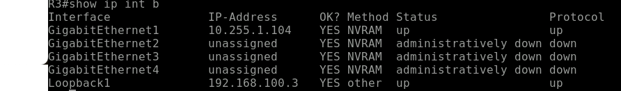

# Terraform IOS XE Modular Multi-Device Loopback Automation

## Overview
This project demonstrates how to use **Terraform** as Infrastructure as Code (IaC) to automate the configuration of **loopback interfaces across multiple Cisco IOS XE routers** using a **modular design**.

The solution provisions loopback interfaces on three routers (**R1, R2, R3**) using a reusable Terraform module and RESTCONF-based communication.

---

## Objectives
- Automate network configuration using Terraform  
- Apply modular design principles for scalability  
- Configure multiple devices using a single codebase  
- Demonstrate Infrastructure as Code in networking  

---

## Architecture

### Network Topology

The topology consists of:
- 3 IOS XE routers (R1, R2, R3)
- Management connectivity via RESTCONF
- Loopback interfaces configured via Terraform module

---

## Technologies Used
- Terraform  
- Cisco IOS XE RESTCONF Provider  
- Infrastructure as Code (IaC)  
- Modular Terraform Design  

---

## Configuration Details

### Multi-Device Setup
Routers are defined in the Terraform provider:
- R1 
- R2  
- R3

### Modular Implementation
A reusable module is used to:
- Create loopback interfaces  
- Assign IP addresses  
- Ensure consistent configuration across all routers  

---

## Results

### Loopback Configuration Verification

The Terraform deployment successfully configured loopback interfaces across all routers using a single modular approach.

- **R1** → Loopback1 configured with IP `192.168.100.1`  
- **R2** → Loopback1 configured with IP `192.168.100.2`  
- **R3** → Loopback1 configured with IP `192.168.100.3`  

The configurations were applied consistently across all devices using the reusable Terraform module.

### Verification Output

  
   
  <em>Terraform plan output showing the creation of loopback interfaces across multiple IOS XE routers before applying changes</em>

  
   
  <em>R1 – Loopback1 configured with IP 192.168.100.1</em>

  
   
  <em>R2 – Loopback1 configured with IP 192.168.100.2</em>

  
   
  <em>R3 – Loopback1 configured with IP 192.168.100.3</em>

## Notes

- This project uses **RESTCONF** to communicate with Cisco IOS XE devices. Ensure RESTCONF is enabled on the routers.
- Credentials and IP addresses are defined for a **lab environment only**.
- Sensitive data such as passwords stored securely (using `terraform.tfvars` and `.gitignore`).
- The modular approach allows easy scaling to additional devices by updating the local variable map.
- This project focuses on loopback automation, but the same structure can be extended to full network provisioning.

---

## Author

**Amina Ahmed**  
Packet Core & IP Network Engineer | Network Automation Enthusiast
